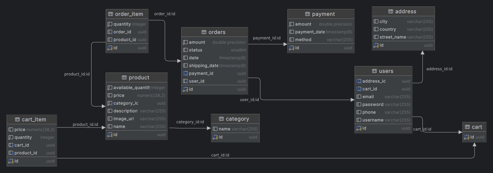

# Full-Stack E-Commerce Web App

A full-stack e-commerce platform with a Spring Boot REST API backend and an Angular frontend.

## Demo

https://github.com/user-attachments/assets/f2be4757-3a29-4e8a-9abe-9efd9d03db03


## Tech Stack

| Layer | Technology |
|-------|-----------|
| Backend | Java, Spring Boot, Spring Security (JWT), Spring Data JPA, Hibernate |
| Frontend | Angular, TypeScript |
| Database | PostgreSQL |
| Build | Maven (backend), npm (frontend) |

## Features

- **User authentication** -- registration and login with JWT-based security
- **Product catalog** -- browse products by category with filtering
- **Shopping cart** -- add/remove items, update quantities
- **Order management** -- place orders and track status
- **File uploads** -- product image upload support
- **Category management** -- organize products into categories
- **Address management** -- save and manage shipping addresses
- **Payment processing** -- integrated payment flow

## Project Structure

```
.
├── backend/
│   └── src/main/java/com/farid/backend/
│       ├── config/          # Security config, JWT filter & service
│       ├── dto/             # Data transfer objects
│       ├── entity/          # JPA entities (User, Product, Cart, Order, Payment, etc.)
│       ├── repository/      # Spring Data JPA repositories
│       ├── rest/            # REST controllers
│       └── service/         # Business logic
├── frontend/
│   └── src/app/
│       ├── cart/            # Shopping cart component
│       ├── categories/      # Category browsing
│       ├── featured-products/
│       └── ...
```

## API Endpoints

| Method | Endpoint | Description |
|--------|----------|-------------|
| POST | `/api/users/register` | Register a new user |
| POST | `/api/users/login` | Authenticate and get JWT token |
| GET | `/api/products` | List all products |
| GET | `/api/categories` | List all categories |
| POST | `/api/cart` | Add item to cart |
| GET | `/api/cart` | View cart contents |
| POST | `/api/orders` | Place an order |

## How to Run

**Prerequisites:** Java 17+, Node.js, Docker

### Quick Start

```bash
# Start everything (PostgreSQL, backend, frontend) with one command:
./start.sh
```

### Manual Setup

```bash
# 1. Start PostgreSQL
docker compose up -d

# 2. Create image upload directory (first time only)
sudo mkdir -p /var/www/images && sudo chmod 777 /var/www/images

# 3. Start backend (http://localhost:8080)
cd backend
./mvnw spring-boot:run

# 4. Start frontend (http://localhost:4200)
cd frontend
npm install
ng serve
```

### Stop Services

```bash
# Stop PostgreSQL
docker compose down

# Stop and wipe database
docker compose down -v
```

## Database ERD



## Screenshots

### Authentication

#### Register Page


#### Login Page


### User Interface

#### Home Page - Shop by Categories & Featured Products


#### Shopping Cart


#### User Profile


#### Seller Dashboard

